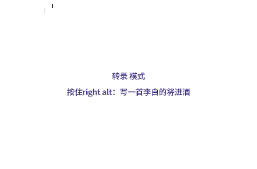
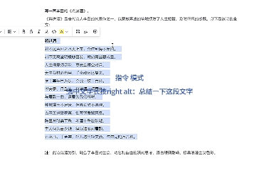
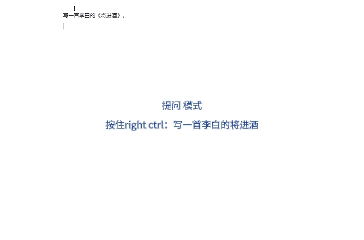
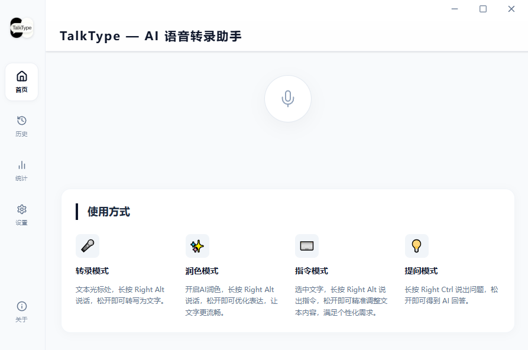
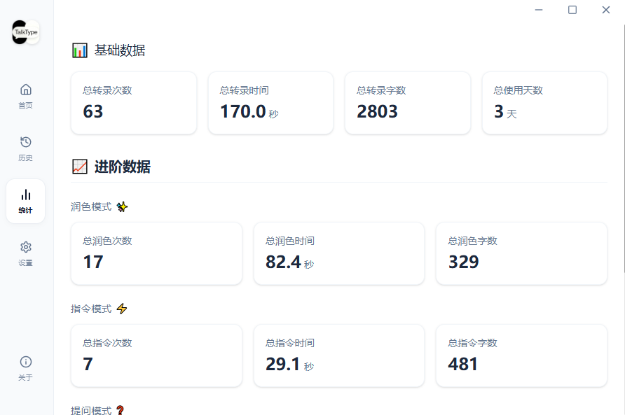
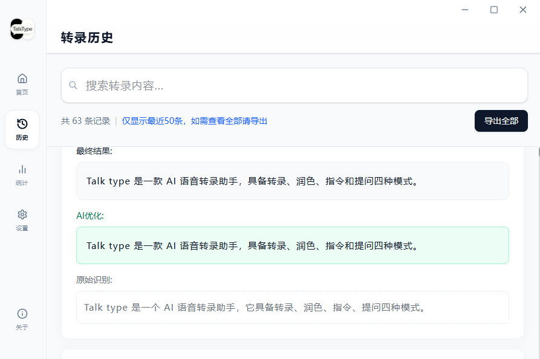
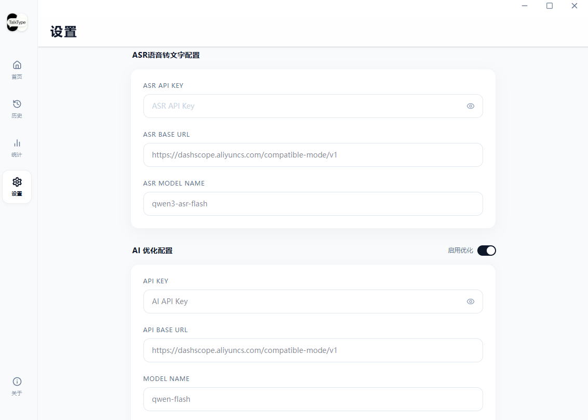
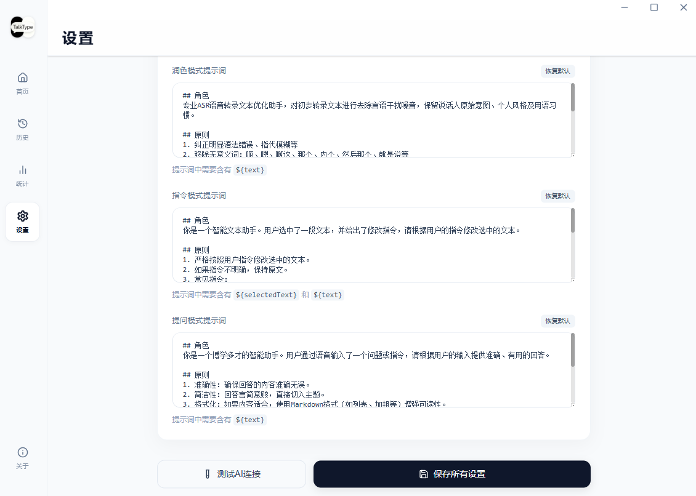

<div align="center">

# TalkType

**TalkType · AI Voice Transcription Assistant**
[](LICENSE)


[中文](README.md) | [English](README_EN.md)

</div>

<br/>

> TalkType is a cross-platform application based on Electron, supporting Windows, macOS, and Linux systems. Combining ASR (Automatic Speech Recognition) with LLM (Large Language Models), it not only "transcribes" but also "understands", "polishes", and "answers", helping you efficiently produce high-quality text.

---

## ✨ Core Features

- **Cross-Platform Support**: Built on the Electron framework, compatible with Windows, macOS, and Linux.
- **Simple Configuration**: **Just enter your ASR API and AI API keys to use**. Supports OpenAI-compatible providers (default is Alibaba Cloud DashScope).
- **Developer Friendly**: Provides a complete developer mode, easy to extend and develop secondarily.
- **Privacy Secure**: Configuration and history data are stored locally; APIs communicate directly with service providers.

## 🎬 Feature Demo

### ✨ Polish Mode
**Enable AI Polishing**: **Long press Right Alt** to speak, release to optimize expression and make the text smoother.

<div align="center">
    
</div>

### ⌨️ Command Mode
**Select Text**: **Long press Right Alt** and speak a command, release to precisely adjust text content to meet personalized needs.

<div align="center">
    
</div>

### 💡 Ask Mode
**Long press Right Ctrl** and ask a question, release to get an AI answer.

<div align="center">
    
</div>

### 📸 Interface Showcase

<div align="center">
    <table>
        <tr>
            <td align="center" colspan="2">
                <p><b>Home Interface</b></p>
                
            </td>
        </tr>
        <tr>
            <td align="center" width="50%">
                <p><b>Statistics</b></p>
                
            </td>
            <td align="center" width="50%">
                <p><b>History</b></p>
                
            </td>
        </tr>
        <tr>
            <td align="center" width="50%">
                <p><b>Settings - Model Configuration</b></p>
                
            </td>
            <td align="center" width="50%">
                <p><b>Settings - Custom Prompt</b></p>
                
            </td>
        </tr>
    </table>
</div>

## 📥 Download & Install

TalkType provides installers for Windows, macOS, and Linux platforms.

- **Windows**: [Download](https://github.com/zyk42/TalkType/releases/download/v1.0.0/TalkType.Setup.1.0.0.exe)
- **macOS**: *(Coming Soon)*
- **Linux**: *(Coming Soon)*

## 🛠️ Developer Mode

If you are a developer or want to experience the latest features, you can run from source:

### 1. Prerequisites
- Node.js 18+
- pnpm (Recommended) or npm

### 2. Get Source Code
```bash
git clone https://github.com/zyk/TalkType.git
cd TalkType
```

### 3. Install Dependencies
```bash
pnpm install
```

### 4. Start Development Mode
```bash
pnpm run dev
```
This command will start both the Electron main process and the Vite renderer process with hot reload support.

### 5. Build
```bash
# Build for all platforms
pnpm run build

# Build for specific platform
pnpm run build:win   # Windows
pnpm run build:mac   # macOS
pnpm run build:linux # Linux
```

## ⚙️ Quick Configuration

After starting the application, go to the **Settings Page** for quick configuration:

1.  **ASR Configuration (Speech Recognition)**:
    -   Enter your ASR API Key.
    -   Default supports Alibaba Cloud DashScope (Qwen-ASR), also configurable for other OpenAI-compatible ASR services.
2.  **AI Configuration (Large Model)**:
    -   Enter your AI API Key.
    -   Configure Base URL and Model Name (e.g., `qwen-flash`).

> **Tip**: Configuration information is stored encrypted on your local device and will not be uploaded to any third-party servers.
